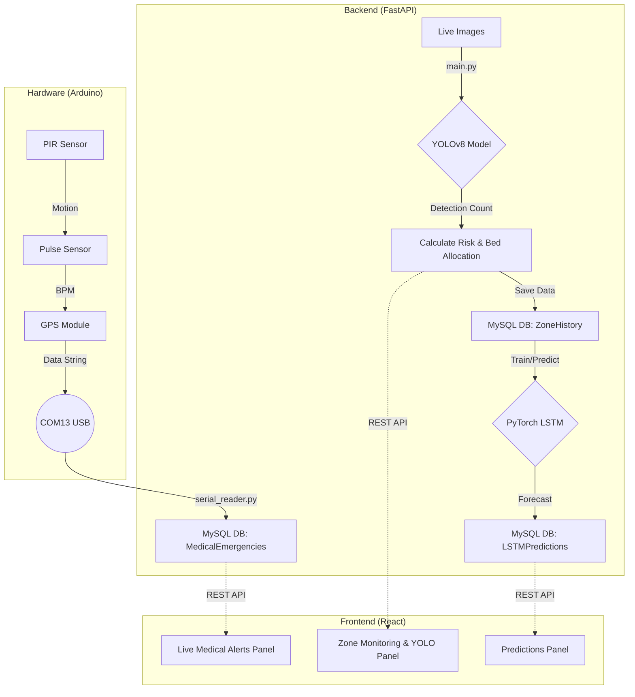

# 🌍 EcoRescue — AI-Powered Disaster Management System


**EcoRescue** is a comprehensive, real-time disaster management dashboard. It integrates Computer Vision for population monitoring, IoT Hardware for medical emergencies, and Deep Learning for predictive risk analysis.

---

## 📸 System Dashboard
*(Dashboard showing live alerts, zone status, and predictions)*

<div align="center">
  <pre>
  ┌────────────────────────────────────────────────────────┐
  │ 🌍 ECO RESCUE                  System Status: 🚨 ALERT │
  ├────────────────────────────────────────────────────────┤
  │ 👥 People Detected: 3,024    🛏️ Beds Available: 120    │
  │ 📍 Active Zones: 4           🔥 Active Alerts: 3       │
  ├────────────────────────────────────────────────────────┤
  │ 📍 Zone Monitoring                                     │
  │ [Indira Nagar] [Bellandur] [E-City] [RR Nagar]         │
  ├────────────────────────────────────────────────────────┤
  │ 📸 Live YOLO Detection                                 │
  │ [Image 1] [Image 2] [Image 3] [Image 4]                │
  ├────────────────────────────────────────────────────────┤
  │ 💗 Live Medical Emergencies (Arduino)                  │
  │ [115 BPM - ABNORMAL] [78 BPM - NORMAL]                 │
  ├────────────────────────────────────────────────────────┤
  │ 🔮 LSTM Risk Predictions                               │
  │ [Zone 1: 150.25 (Severe)] [Zone 2: 45.30 (Caution)]    │
  └────────────────────────────────────────────────────────┘
  </pre>
</div>

---

## 🚀 Features & Modules

### 👁️ YOLOv8 People Detection
- Runs object detection on disaster zone images every 5 seconds.
- Cumulatively tracks survivor counts per zone.
- Automatically allocates available shelter beds and assigns volunteers based on the population.

### 🧠 LSTM Risk Prediction
- PyTorch-based Deep Learning model (Single-layer LSTM, 64 hidden units).
- Analyzes historical risk trends (`ZoneHistory`) to forecast the next period's risk score.
- Categorizes risk into: `Safe`, `Caution`, `Elevated`, `Severe`.

### 🫀 IoT Hardware Integration (Arduino)
- Hardware sensors connected via `COM13` port.
- **PIR Sensor** triggers on human motion.
- **Pulse Sensor** captures BPM.
- **GPS Module (NEO-6M)** logs exact coordinates.
- Anomalies (e.g., BPM > 100) instantly reserve a bed and trigger a `Severe` system alert.

### 💻 Live React Dashboard
- Built with React, Vite, and Tailwind CSS.
- Subscribes to real-time FastAPI endpoints.
- Features dynamic color-coded UI elements with micro-animations.

---

## 🛠 Tech Stack

| Layer | Technologies |
|-------|--------------|
| **Frontend** | React 18, TypeScript, Vite, TailwindCSS |
| **Backend** | Python 3.10+, FastAPI, Uvicorn, PySerial |
| **AI/ML** | YOLOv8 (Ultralytics), OpenCV, PyTorch (LSTM) |
| **Database** | MySQL 8.0 |
| **Hardware** | Arduino UNO, PIR Sensor, Pulse Sensor, GPS NEO-6M |

---

## 🔄 Visual Architecture Flow



---

## ▶️ How to Run Locally

### 1. Database Setup
You will need MySQL 8.0 running.
```bash
# Navigate to the SQL directory
cd ECORESCUE.SQL

# Run the setup script in MySQL CLI or Workbench
source ecorescue.sql
```

### 2. Start the Backend
Requires Python 3.10+.
```bash
cd backend

# Create and activate virtual environment (recommended)
python -m venv backend-env
backend-env\Scripts\activate

# Install dependencies
pip install -r requirements.txt

# Run the FastAPI server
python main.py
# Server will run on http://localhost:8000
```
*Note: If the Arduino hardware is not connected, the serial reader will silently retry in the background without crashing the application.*

### 3. Start the Frontend
Requires Node.js 18+.
```bash
cd frontend-new

# Install dependencies
npm install

# Start the Vite development server
npx vite --port 5173
# Dashboard will run on http://localhost:5173
```

---

## 📡 API Endpoints Summary

| Method | Endpoint | Description |
|--------|----------|-------------|
| `GET` | `/api/zones` | Current stats for all zones |
| `GET` | `/api/yolo-images` | Live YOLO-annotated images (Base64) |
| `GET` | `/api/medical-alerts` | Recent medical emergencies from hardware |
| `GET` | `/api/predict/{zone_id}` | Next period LSTM risk prediction |
| `GET` | `/api/zone-history-all` | Historical risk trends across all zones |
| `GET` | `/api/alerts` | Current system alerts (Caution/Elevated/Severe) |

---
*Built as a 5th Semester Interdisciplinary Project (IDP) blending AI, IoT, Web Dev, and DBMS.*
